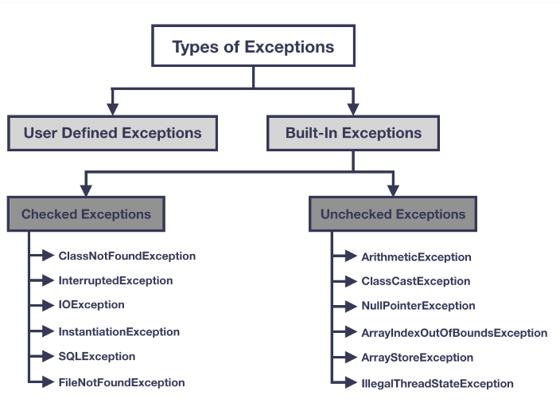

# Tratamento de Exceções    

Uma exceção é considerada um comportamento inesperado do sistema ou do usuário, por exemplo: divisão por zero, tentar acessar um elemento fora do tamanho da lista, ou digitar inteiros num campo de letras e vice-versa, entre outros. 

Tratar uma exceção é um jeito de não interromper o fluxo do programa, significa tolerar algumas falhas.

Quando uma exceção ocorre, o Java **cria um Objeto** da classe _Exception_ com as informações necessárias (tipo de exceção, número da linha em que a exceção foi gerada, etc) 

## Usando o bloco try-catch

O bloco try-catch é utilizado para manusear exceções. Primeiro escrevemos dentro do bloco `try`, todo o código que queremos testar, por exemplo, uma conexão a um banco de dados. Em seguida utilizamos o bloco `catch` para capturar as possíveis exceções que foram encontradas, por exemplo, servidor não encontrado.

A sintaxe básica seria:

```java

try {
    // Código para tentativa vai aqui
}
catch (ExceptionClassName nomeParametro ) {
    // O código para tratar exceções vai aqui
}
```

Note que o bloco `catch` é parecido com um método e que no parênteses vai o nome da classe de exceção e um nome que é dado pelo usuário.

Um exemplo de tratativa para divisão por zero seria:

```java 

public class DivideByZeroWithTryCatch {
    public static void main(String[] args) {
        int x = 10, y = 0, z;
        try {

            z = x / y;
            System.out.println("z = " + z);
        } catch (ArithmeticException e) {
            // Pega a descrição da exceção
            String msg = e.getMessage();
            // Imprime uma mensagem customizada
            System.out.println("Um erro ocorreu, o erro é: " + msg);
        }
        System.out.println("Fim do programa.");
    }
}

```

O output será: 

```
Um erro ocorreu, o erro é: / by zero
Fim do programa.
```

Observe que o programa imprimiu a instrução "Fim do programa", poiso erro foi tratado e não encerrou o programa antes.

As exceções embutidas no Java podem ser de dois tipos: **verificadas** (_checked_) e **não-verificadas** (_unchecked_).  

### Exceções verificadas

Todas herdam da classe _Exception_ e representam condições inválidas fora do controle do programador, como entradas inválidas, não acessa algum arquivo, falha de rede. Nesse caso é necessário algum método para manipular a exceção.

### Exceções não verificadas

Elas representam defeitos no programa e são subclasses de RuntimeException, e nesse caso, não é obrigatório tratar dessas exceções.

Além destas duas podemos ter exceções criadas pelo próprio programador. O quadro abaixo traz um pequeno esquema dos tipos de exceções.



## O bloco _finally_

O `finally` é utilizado no final de um bloco try-catch e sempre será executado. Seu objetivo é evitar vazamento de recursos, como arquivos abertos no computador, conexão com banco de dados, etc, que podem consumir memória. É uma forma de dar continuidade ao programa, no caso de acontecer erro naquilo que você está tentando, ele irá tratar o erro e dar continuidade.

## Lançando exceções com a instrução _throw_

A expressão `throw` permite lançar uma exceção sem estar dentro de um bloco try-catch, por exemplo: num campo para inserção de e-mail podemos lançar uma exceção caso o campo esteja vazio, conforme código:

```java 
public Email(String email) {
		if (email == null) {
			throw new NullPointerException("E-mail não pode ser nulo");
		}
```

## Assertions

As `assertions` são uma forma de afirmar uma expressão de maneira forte, confiante e contundente. Ela é utilizada para algo que é esperado que seja verdadeiro. Pode parecer redundante, mas nem sempre os conceitos são tão óbvios na programação.

As assertions ajudam a identificar possíveis erros de lógica durante o desenvolvimento, assegurando que o código funciona corretamente. 

Exemplo:

```java 

// Verificando com assert se um valor está dentro do intervalo
import java.util.Scanner;

public class AssertTest {
    public static void main(String[] args){
        Scanner input = new Scanner(System.in);
        System.out.print("Digite sua idade: ");
        int idade = input.nextInt();
        // afirma que a idade é >= 0 e <= 150
        assert (number >= 0 && number <= 150) : "Idade Incorreta: " + number;
        System.out.printf("Você tem %d%n anos", number);}
} 
// fim da classe AssertTest

```

No exemplo acima, queremos constatar que o usuário digitou uma idade entre 0 e 150, pois seria um absurdo esperar um valor fora desse intervalo. E fazemos essa afirmação com o `assert`.


## Referências

* https://rollbar.com/blog/how-to-handle-checked-unchecked-exceptions-in-java/#:~:text=In%20broad%20terms,%20a%20checked,and%20running%20the%20second%20time.
* Deitel, Paul. **Java: como programar** / Paul Deitel, Harvey Deitel; tradução Edson Furmankiewicz; revisão técnica Fabio Lucchini. -- São Paulo: Pearson Education do Brasil, 2017
* SHARAN, Kishori; DAVIS, Adam L. . **Beginning Java 17 Fundamentals**: Object-Oriented Programming in Java 17. Third edition. Apress.
