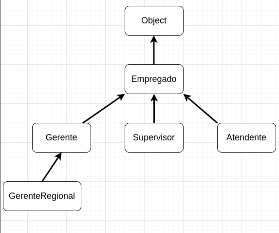

# Herança

O conceito de herança (*inheritance*) em programação orientada à objetos se aplica na **reutilização de código** em uma aplicação e na **customização desse código**. 
Ao invés de repetir o código diversas vezes, aplicamos o conceito de herança, no qual um nova classe é formada a partir de uma classe anterior, reutilizando o código.
Como também, essa organização de classes que herdam, permite que um mesmo método seja modificado apenas na classe originária e que produza efeitos em todas as classes derivadas, facilitando a **manutenção do código**.


## Herdando uma classe

Atributos e  métodos podem ser herdados de uma classe pai para uma classe filho, ou, em outras palavras, de uma superclasse para uma subclasse. A linguagem Java usa a palavra-chave `extends` para indicar a relação entre as classes, conforme a sintaxe geral:

```java

[modificador] class <nome-da-subclasse> extends <nome-da-superclasse> {
	//o código da subclasse vai aqui
}

```


Se a subclasse e a superclasse não estiverem no mesmo pacote é necessário importar o nome da superclasse.

Importante: Java permite herdar de uma única classe.

## Exemplo conceitual

Um sistema de RH pode conter uma superclasse **empregado** com métodos que atendem a todos os funcionários indistintamente tais como `getNome()`, `setNome()`, além de atributos como `cpf`, `temFilhos`, `estadoCivil`, entre outros. 
E, no mesmo sistema, ao precisarmos criar uma classe mais específica como por exemplo de **gerentes**, que herdaria os métodos e atributos básicos da classe **empregado**, e acrescentaria métodos específicos como `atingiuMeta`, `bonificacao`, etc.

Importante: Se um classe não especifica uma herança com a palavra-chave `extends`, então ela herda da `java.lang.Object class`, portanto, estamos sempre usando a herança, mesmo que implicitamente.




## O operador instanceof

Java possui um operador binário chamado `intanceof` que verifica se um objeto é de determinado tipo. A sintaxe geral é:


```java

<variável-referência> instanceof <nome-tipo>

```

Se a variável de referência refere a um objeto do tipo indicado então ela retorna verdadeiro, do contrário, ela irá retornar falso.

## Sobreposição de método (*Method Overriding*)

A sobreposição de método (*overriding*) ocorre quando redefinimos um método herdado de uma superclasse. Por exemplo: 

```java
public class A {
    public void print() {
        System.out.println("A");
    }
}
public class B extends A {
    @Override
    public void print() {
        System.out.println("B");
    }
}

```

A classe B herda o método `print()` da classe A, porém, ele redefine seu comportamento. Se acaso tivermos uma classe C herdando de B, então ela já irá herdar o método redefinido em B, pois ela é a superclasse imediata.

### Regras de Sobreposição de Métodos 

* A sobreposição de métodos não se aplica a métodos estáticos. 
*  O método sobreposto deve ter o mesmo nome que o método anterior.
*  O método sobreposto deve ter o mesmo número de parâmetros, e do mesmo tipo, que seu anterior.
*  O nível de acesso do método sobreposto deve ser o mesmo ou um mais relaxado, conforme tabela: 

| Nível de acesso do método anterior  | Nível de acesso permitido para método substituído   |
|---|---|
| public  | public |
| protected  | public, protected   |
| package level  | public, protected, package level   |


## Sobrecarga de Método (*Method Overloading*)

Ter mais de um método com o mesmo nome em uma mesma classe é chamado de sobrecarga de método. A sobrecarga de métodos ocorre quando temos um número diferente de parâmetos, diferentes tipos de parâmetros, ou ambos.

A sobrecarga de métodos está mais relacionada com o polimorfismo do que com a herança.

### Diferenças importantes entre sobrecarga e substituição de métodos

| Substituição   | Sobrecarga  |
|---|---|
| Envolve herança e ao menos duas classes  | Envolve apnas uma classe.  |
| mesmo nome, mesmo número, ordem e tipo  de parâmetro  | Diferentes parâmetros (ordem, número, tipo)  |
| Aplica-se apenas a métodos da instância (não-estáticos)   | Apĺica-se a qualquer método  |


## Referências
* SHARAN, Kishori; DAVIS, Adam L. . **Beginning Java 17 Fundamentals**: Object-Oriented Programming in Java 17. Third edition. Apress.
* [Operador instanceof em Java](https://receitasdecodigo.com.br/java/operador-instanceof-java)