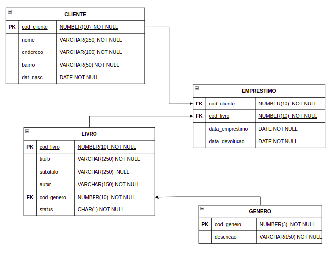
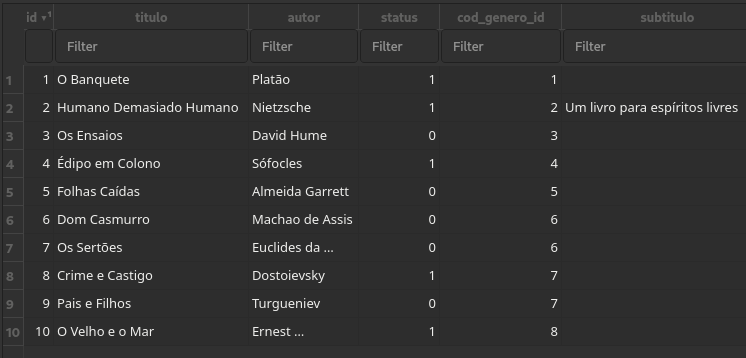
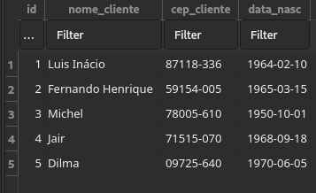

# Exercício SQL


## Descrição do exercício

Através do banco de dados [SQLite](https://www.sqlite.org/index.html) e do [SQLiteBrowser](https://sqlitebrowser.org), é criado um modelo de negócios simples simulando uma biblioteca para realizar a criação das tabelas e operações básicas de consulta, utilizando a linguagem SQL.

## Modelo de negócios: Biblioteca



## Dados

Para exemplificar o exercício temos um banco de dados com apenas 10 linhas, cada linha representando um livro:


E como clientes apenas 05 usuários:



## Exercícios 

### 1. Criando Tabelas

- Tabela CLIENTE:
```sql

CREATE TABLE "biblioteca_cliente" 
("id" integer NOT NULL PRIMARY KEY AUTOINCREMENT,
"nome_cliente" varchar(400) NOT NULL,
"cep_cliente" varchar(9) NOT NULL,
"data_nasc" date NOT NULL);


```
- Tabela GENERO:
```sql
CREATE TABLE "biblioteca_genero" 
("id" integer NOT NULL PRIMARY KEY AUTOINCREMENT,
 "descricao" varchar(200) NOT NULL);


```

- Tabela LIVRO:
```sql
CREATE TABLE "biblioteca_livro" 
("id" integer NOT NULL PRIMARY KEY AUTOINCREMENT,
"titulo" varchar(250) NOT NULL,
"subtitulo" varchar(200) NULL,
"autor" integer NOT NULL,
"status" integer NOT NULL,
"cod_genero_id" bigint NOT NULL REFERENCES "biblioteca_genero" ("id")
);

```
- Tabela EMPRESTIMO:
```sql
CREATE TABLE "biblioteca_emprestimo" 
("id" integer NOT NULL PRIMARY KEY AUTOINCREMENT,
 "data_emprestimo" date NOT NULL,
 "cod_cliente_id" bigint NOT NULL REFERENCES "biblioteca_cliente" ("id") ,
 "cod_livro_id" bigint NOT NULL REFERENCES "biblioteca_livro" ("id")
);


```

### 2. Exibir nome de livros disponíveis

Exibir nome de livros disponíveis (com status igual a 1) e a descrição de seu gênero literário.

```sql
SELECT A.titulo, B.id
FROM biblioteca_livro A, biblioteca_genero B
WHERE A.cod_genero_id = B.id
AND A.status= 1

```

RESULTADO:


### 3. Exibir livros de determinado gênero

Exibir nome, autor e status de livros de Literatura Brasileira.

```sql
SELECT A.titulo, A.autor, A.status, B.descricao
FROM biblioteca_livro A, biblioteca_genero B 
WHERE A.cod_genero_id = B.id
AND B.descricao = 'Literatura Brasileira'
```
RESULTADO:


### 4. Usando a função COUNT()

Query para exibir usuários que mais fizeram empréstimos:

```sql
SELECT A.nome_cliente, COUNT(B.cod_cliente_id)
FROM biblioteca_cliente A, biblioteca_emprestimo B
WHERE A.id = B.cod_cliente_id
GROUP BY A.nome_cliente
HAVING COUNT (B.cod_cliente_id)
```


## Observações

O exercício proposto é extremamente simplificado e o único objetivo é o de demonstrar minimamente a ordenação de comandos quando queremos fazer uma consulta (query) utilizando a linguagem SQL.

Ainda haveria muito a explorar, como por exemplo, a criação de uma tabela EDITORA para a tabela LIVROS, ou a tabela de ENDEREÇO completo para a tabela CLIENTES.