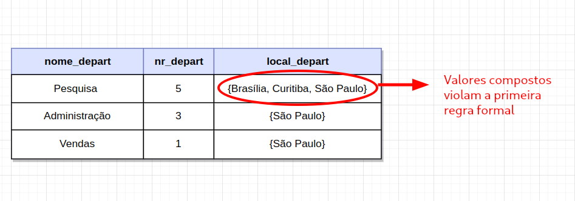
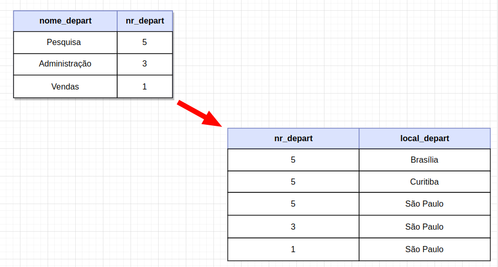
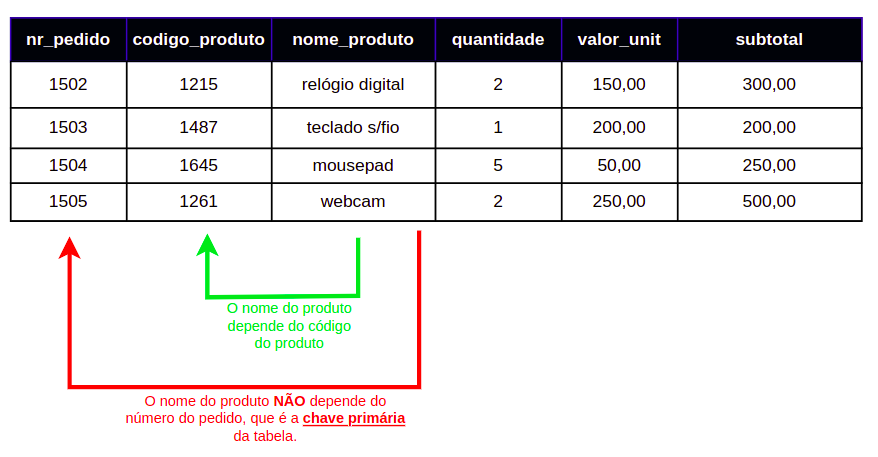
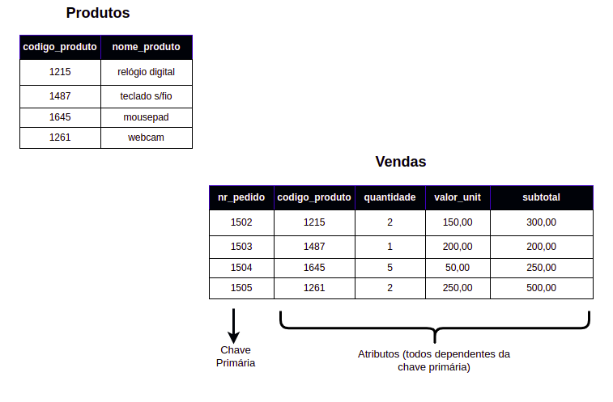
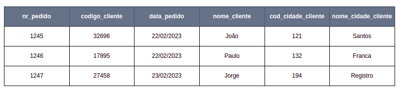
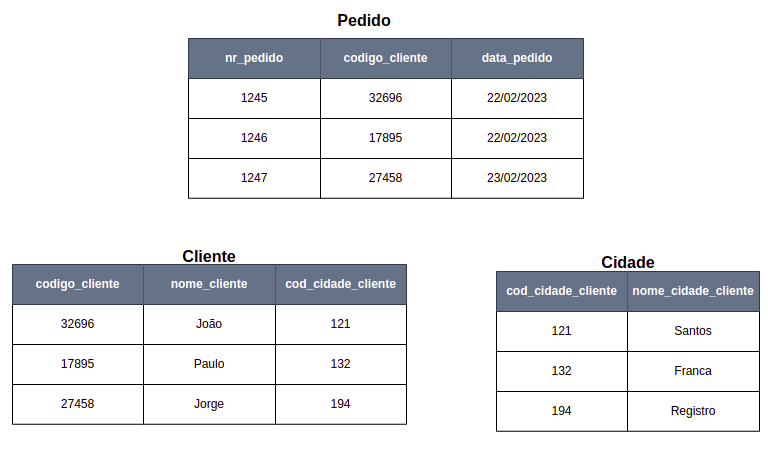

# Normalização

Normalização é processo do qual os esquemas de relação são sucessivamente **decompostos** até que satisfaçam determinadas propriedades ou formas normais, **evitando redundância e reduzindo a complexidade**.

A qualidade de um projeto de banco de dados pode ser
medida a partir da verificação da forma normal que ele
alcança.

## Conceitos: Dependência Funcional e Transitiva

**Dependência Funcional:** Uma dependência funcional é um relacionamento entre dois ou mais atributos, de forma que o valor de um atributo identifica o valor do outro atributo, por exemplo, com o número de matrícula de um aluno, encontramos o nome deste aluno. Pode ser representado como: CPF -> nome_aluno.

**Dependência Funcional Transitiva:** Quando um ou mais campos de uma entidade não são dependentes diretamente da chave primária, ou de parte dela, mas sim dependente de outro campo da tabela (campo este que não a Chave Primária), temos uma dependência funcional transitiva.

## Primeira Forma Normal (1FN)

A mais simples das formas normais consiste em: 

- Eliminar atributos compostos e/ou multivalorados.
- Impedir "relações dentro de relações", "tabelas dentro de tabelas".
- Garantir que os valores sejam atômicos.

Para normalizar a tabela acima de acordo com a 1FN, cria se outra tabela relacionando as localizações aos números de departamentos:

## Segunda Forma Normal (2FN)

Uma relação **R** estará de acordo com a segunda forma normal (2FN) se:

- previamente, ela estiver de acordo com a 1FN;
- todo o atributo de **R** não pertecente a uma de suas chaves for totalmente dependente da chave primária;
- a relação não possuir nenhuma dependência parcial.

Considere a seguinte tabela, que **não** está de acordo com a 2FN:

Para normalizar esta tabela cria-se uma tabela para **Produtos** e outra tabela para **Vendas**:

## Terceira Forma Normal (3FN)

A terceira forma normal visa eliminar dependência transitiva de atributo **não-chave**, ou seja, quando encontramos um atributo que depende de outro atributo, sendo que nenhum dos dois é uma chave primária, precisamos corrigir a tabela para a terceira forma normal.

Fazendo a análise de dependência funcional de cada atributo, concluimos que:

- **nr_pedido** chegamos ao **codigo_cliente**;
- **nr_pedido** chegamos na **data_pedido**;
- **codigo_cliente** chegamos no **nome_cliente**;
- **codigo_cliente** chegamos no **cod_cidade_cliente**;
- **cod_cidade_cliente** chegamos no **nome_cidade_cliente**.

Observa-se que apenas os atributos primos **codigo_cliente** e **data_pedido** dependem não transitivamente da chave primária.

Para normalizarmos, de acordo com a 3FN, resolvemos da seguinte maneira: 

## Forma Normal de Boyce-Codd
Esta forma normal é considerada uma extensão da 3.ª forma normal, porém, mais rígida. 
Esta norma afirma que todos os dados em uma tabela devem depender apenas da chave primária dessa tabela e não de qualquer outro campo da tabela.

## Vantagens da Normalização

Com a aplicação das regras formais evitamos problemas como:

- grupos repetitivos (atributos multivalorados) de dados;
- variação temporal de certos atributos, dependências funcionais totais ou parciais em relação a uma chave concatenada;
- redundâncias de dados desnecessárias;
- perdas acidentais de informação;
- dificuldade na representação de fatos da realidade observada;
- dependências transitivas entre atributos.

## Referências
- [Banco de Dados - Normalização - Parte 1 - Prof. Eduardo Santarém (UNIVESP)](https://www.youtube.com/watch?v=Mhd2bI5pJuo)
- [Banco de Dados - Normalização - Parte 2 - Prof. Eduardo Santarém (UNIVESP)](https://www.youtube.com/watch?v=jnT7BnrVSmo)
- [Segunda Forma Normal 2FN - Luis Blog](https://www.luis.blog.br/segunda-forma-normal-2fn-normalizacao-de-dados.html)
- [Terceira Forma Normal 3FN - Luis Blog](https://www.luis.blog.br/terceira-forma-normal-3fn-normalizacao-de-dados.html)
- [Fundamentos de Armazenamento e manipulação de Dados - Prof. Andre Rodrigo Sanches (USP)](https://www.ime.usp.br/~andrers/aulas/bd2005-1/aula11.html)
- [O que são formas normais em bancos de dados sql? - Hashtag Treinamentos](https://www.hashtagtreinamentos.com/o-que-sao-formas-normais-em-bancos-de-dados-sql?gclid=CjwKCAiA9NGfBhBvEiwAq5vSyzDKGU_rTk0F8SpdfZ2i9VJIN48Y6JCAyhAfeNjPiJJ6_SSGx1FpXBoC6KIQAvD_BwE)