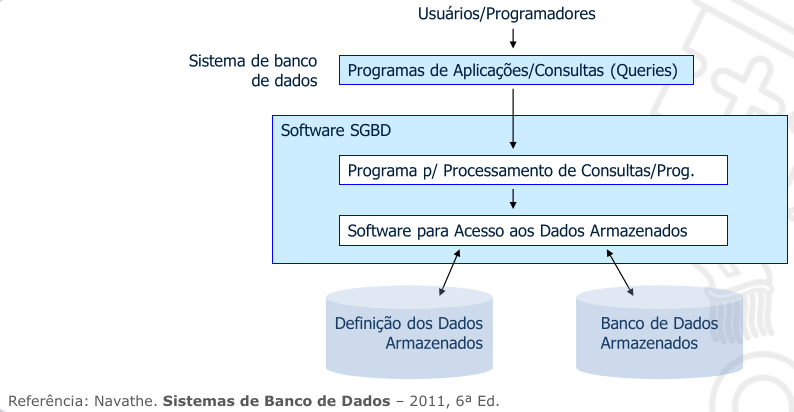

# Banco de Dados Relacional [em construção]
O modelo de dados relacional foi introduzido por Edgar Codd em 1970 (IBM).

É um modelo formal, baseado na teoria matemática das relações entre conjuntos.

O modelo de dados relacional é uma linguagem unificada para definição e manipulação de dados.

Os SGBDs Relacionais mais conhecidos hoje são MySQL (Oracle), Oracle (Oracle) e SQL Server (Microsoft).

A ideia de modelo relacional era representar entidade e relacionamento de maneira uniforme.

No modelo relacional, cada linha na tabela corresponde a uma entidade ou relacionamento do mundo real.

As colunas no modelo relacional (atributos de uma
entidade), especificam como interpretar os valores de
dados em cada linha.

## ACID
Atomicidade (a transação é executada totalmente ou é
executada)
Consistência (sistema sempre consistente após
uma operação)
Isolamento (transação não sofre interferência de outra transação concorrente)
Durabilidade (o que foi salvo não é mais perdido)
Força a consistência ao final de cada transação

## SGBD 
Pacote de software que facilita a criação e manutenção de
um banco de dados.
• A manipulação dos dados é através da realização de
operações como consultas, alteração de dados, emissão de
relatórios, etc.

# Sistema de Banco de Dados
Sistemas de BD são sistemas desenvolvidos com funções
específicas, que usam Banco de dados, desenvolvidos em
SGBDs.
Sozinho um SGBD não significa nada, com um BD e um
programa escrito para sua manipulação forma-se um
sistema de BD.

## Modelo de Dados
- Modelos de dados conceituais (alto nível)
- Modelos de dados físicos (baixo nível)
- Modelos de dados lógicos (representativos ou de implementação)

## Instancias
Os dados no banco de dados em um determinado momento são
chamados estado do banco de dados (snapshot) ou instâncias.

A cada novo registro inserido ou removido, o estado (instância) do
banco se altera.

## Restrições / Chaves
Uma **chave** é um conjunto mínimo de valores dos atributos
que identifica unicamente uma tupla (linha).
Garante a **restrição de unicidade** entre as tuplas de uma
relação

## SQL
SQL tem uma ligação com o modelo relacional pois o
resultado de uma consulta SQL é uma tabela (também
chamada de conjunto resultado).

A linguagem SQL se divide em subgrupos:

DDL: 
- É a linguagem que define a ESTRUTURA do BD.
- Seus comandos permitem a criação, alteração e
exclusão de objetos em um banco de dados.
- Exemplo: CREATE, ALTER, DROP

 
DML(Linguagem de Manipulação de Dados):
- Linguagem que manipula os dados no banco.
- Seus comandos permitem a recuperação, inserção, alteração
e exclusão de dados.
- Exemplo: INSERT. UPDATE, DELETE

DQL (Linguagem de consulta de Dados):
- Comando SELECT é a instrução Básica para recuperar
informações.
- O formato básico da declaração SELECT é composto por três
cláusulas (SELECT, FROM e WHERE).

