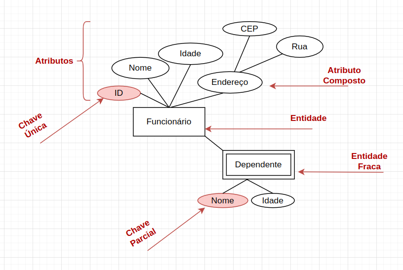
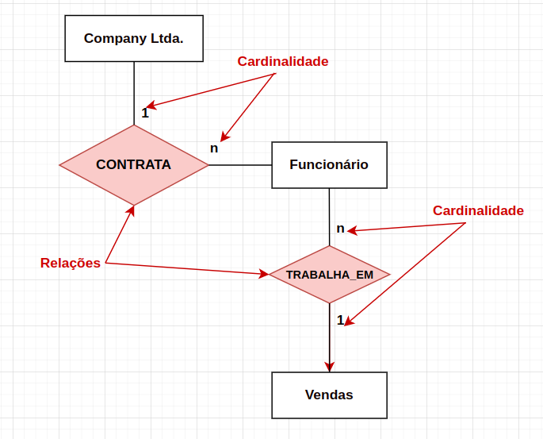

# Banco de Dados Entidade-Relacionamento

 - O Modelo Entidade-Relacionamento (MER) é
um modelo de dados de alto-nível criado com o
objetivo de representar a semântica associada
aos dados do minimundo. 
 - O modelo de dados ER (MER) não possui ligação
nenhum com SGBD.
 - É utilizado para apresentar o
que foi informado no levantamento de requisitos.
 - É utilizado para na fase de projeto
**conceitual**, onde o esquema conceitual do
banco de dados da aplicação é concebido. 
 - O esquema conceitual criado usando-se o MER
é chamado **Diagrama Entidade-Relacionamento** (DER).
```
# MER:  Conjunto de conceitos e elementos de
        modelagem que o projetista de banco
        de dados precisa conhecer.
        
# DER:  Resultado do processo de modelagem
        executado pelo projetista de dados
        que conhece o MER.
```
- O objeto mais elementar que o MER
representa é a **entidade**.
- Cada Entidade tem propriedades particulares
que são chamadas de **Atributos**.


## Atributo-Chave

- Todo Tipo de Entidade deve ter um atributo-chave, seja ele um atributo simples ou composto.
- Os valores de um atributo-chave devem ser
distintos. Esta unicidade deve valer para
quaisquer extensões desse tipo de entidade. 

**Restrição de unicidade:** proíbe que duas entidades, em um
mesmo conjunto entidade, tenham os mesmos valores no seu
atributo chave.

## Diagrama Entidade-Relacionamento (DER)

### Entidade-Atributo


### Relacionamentos





## Cardinalidade
 A cardinalidade define o número de ocorrências de uma entidade relacionada a uma ocorrência de outra entidade. Por exemplo, uma cardinalidade de "1:N" significa que uma entidade pode estar relacionada com várias ocorrências de outra entidade.


- **Relacionamento 1:1 (um para um)** Ex.: uma pessoa possui um único CPF, e um número de CPF pertence a uma única pessoa.
- **Relacionamento 1:n** (um para muitos) Ex.: uma montadora de carros possui vários modelos.
- **Relacionamento n:n** (muitos para muitos): Ex.: um ator participa de vários filmes, um filmes possui vários autores.


---
## Referências
- [ENTIDADE-RELACIONAMENTO E ABORDAGEM RELACIONAL - INSTITUTO FEDERAL DE EDUCAÇÃO, CIÊNCIA E TECNOLOGIA DO RIO GRANDE DO NORTE CAMPUS JOÃO CÂMARA - Nickerson Fonseca Ferreira](file:///home/yusuf/Downloads/A02_BD_MER%20e%20Modelo%20Logico.pdf) 
- [Modelo Entidade - Relacionamento - DCC-IME-USP - João Eduardo Ferreira
Osvaldo Kotaro Takai ](https://www.ime.usp.br/~jef/bd02.pdf)
- [UNIVESP - Banco de Dados - Visão geral sobre banco de dados - José Eduardo Santarem](https://www.youtube.com/watch?v=Uua7T2Dzndk&ab_channel=UNIVESP)
- [UNIVESP - Banco de Dados - Modelo Entidade-Relacionamento (MER) - Parte I: entidades, atributos, chaves ](https://www.youtube.com/watch?v=IpFn-KsWPW0&ab_channel=UNIVESP)