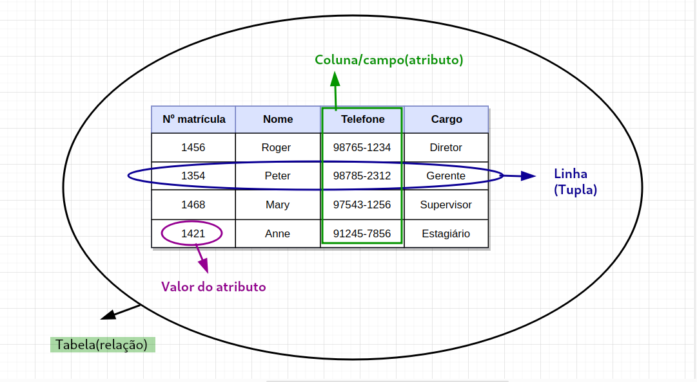
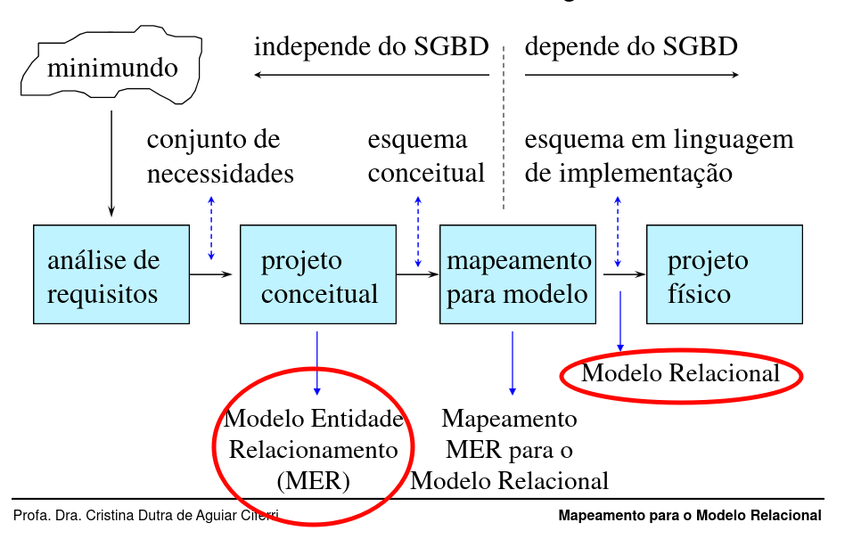

# Modelo Relacional
## Conceitos

- O modelo de dados relacional foi introduzido por **Edgar Codd** em 1970.
- É um modelo formal, baseado na teoria matemática das **relações entre conjuntos**.
- A ideia de modelo relacional é representar ambos, **entidade** e **relacionamento**, de maneira uniforme.
- Cada **linha** na tabela corresponde a uma entidade ou relacionamento do mundo real.
- As **colunas** no modelo relacional (atributos de uma entidade), especificam como interpretar os valores de dados em cada linha.
 - O **grau de uma tabela** (relação) é o número **n** de atributos
do esquema de tabela que a define
 - É atualmente o modelo de banco de dados mais utilizado pelo mercado.

## Terminologia
- Uma **linha (registro)** é chamada **Tupla**.
- Uma **coluna (campo)** é chamado de **Atributo**.
- A **tabela** é chamada **Relação**. 
- O **conjunto de valores (tipo de dados)** que um atributo pode ter se chama **Domínio**. 



## Relações

Esquema de relação é a expressão da forma: 

```
R(A1, A2, A3, ..., An)

- R: nome da relação
- Ai: nome de um atributo, cujo domínio em R é denotado por dom(Ai).
- n: grau de relação
```
Exemplos:

Estudante(nome, idade, matricula, telefone, endereço), Disciplina(nome, sigla, cargaHoraria, creditos)

### Características das Relações:
- A ordem das tuplas é irrelevante.
- Já a ordem dos atributos dentro da tupla são relevantes.
- O valor de cada atributo em uma tupla é **atômico**.
- Atributos compostos e multi-valorados não são permitidos.
- As tuplas de uma relação são únicas

## Restrições do Modelo Relacional

### Restrições de Domínio
- cada atributo possui um domínio que pode ser um inteiro, um float, um caractere, um conjunto de caractere, etc.
- Cada domínio possui **valor atômico**.
- O valor `null` deve ser utilizado quando um atributo não possui valor ou o seu valor não é conhecido.

{==
Sobre um valor ser atômico significa que ele é **indivisível** e **monovalorado** (único valor), que não pode ser recuperado por partes. Por exemplo, _endereço_ deve ser definido como um único atributo no modelo relacional.
==}
### Restrições de Chave
- Uma chave primária identifica univocamente cada tupla da relação.
- Relação é um conjunto de tuplas onde todas as tuplas devem ser distintas.
- **Superchave:** subconjunto de atributos de uma relação que identifique univocamente cada tupla.
- **Chave:** é uma superchave da qual não se pode retirar nenhum atributo.

### Restrições de Integridade
- Restrições de integridade são regras sobre os valores que podem ser armazenados nas relações.
- Tem por objetivo garantir a consistência.
- **Integridade de entidade:** o valor de uma chave não pode ser `null` em nenhuma tupla.
- **Integridade referencial:** mantém consistência entre tuplas de duas relações, definida a _chave estrangeira_ de uma relação **R1** e a _chave primária_ de uma relação **R2**.


## Mapeamento MER -> Relacional
É uma forma de projetar o esquema conceitual para o esquema lógico.



### Características do Mapeamento:
- Para cada entidade forte em MER é criado uma tabela no modelo Relacional.
- Um atributo chave da entidade é escolhido como chave primária para a tabela recém-criada.
- É preciso criar uma nova tabela para cada atributo multi-valorado.
---  


## Referências
- [O Modelo Relacional - Carla Macário(EMBRAPA) , Stefano Baldo(UNICAMP)](https://www.ic.unicamp.br/~geovane/mo410-091/Ch03-RM-Resumo.pdf) 
- [Banco de Dados - Modelo Relacional - Eduardo R. Hrushka (USP)](http://wiki.icmc.usp.br/images/c/c0/Aula_4_eduardo.pdf)
- [Mapeamento do Modelo Entidade-Relacionamento para o Modelo Relacional - Profa. Dra. Cristina Dutra de Aguiar Ciferri(USP) ](http://wiki.icmc.usp.br/images/a/aa/Mat05_Mapeamento.pdf)