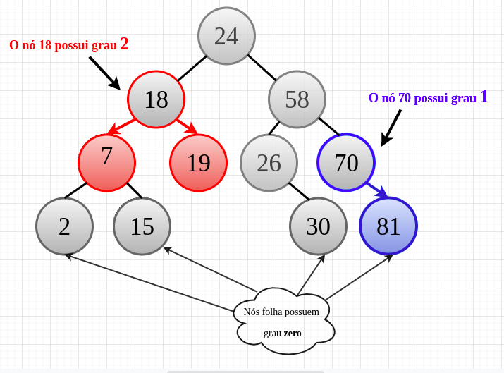

# Árvores

## Conceitos

Uma árvore é um único nó ou um nó raiz conectado a um conjunto de árvores.

Árvores são estrutura de dados **não lineares** e **não sequenciais**, onde os elementos (nós) estão organizados de forma hieráquica e interconectados por meio de arestas (vértices). 
Os nós representam espaços onde podem ser armazenados quaisquer tipos de informações, enquanto as arestas representam o relacionamento entre os nós.

O elemento que não tem predecessor e que fica no topo da árvore é chamado de **raiz**, enquanto os elementos que estão a ele subordinados são chamados de **nós filho**. Já os elementos que não possuem filho são chamados **nós folha**. Conforme imagem:

## Altura, profundidade e Ordem

### Altura do nó

Comprimento do caminho mais longo entre o nó até uma folha. A altura depende dos filhos daquele nó.

### Profundidade de um nó

Também chamado de **nível de um nó**, corresponde a distância percorrida do nó até a raiz, logo, a raiz terá profundidade 0 (zero).

### Grau de um nó

O grau de um nó corresponde ao número de filhos/ número de subárvores que aquele nó possui: 

## Árvore Binária 

Uma árvore binária é uma árvore ordenada, na qual cada nó tem **0**, **1**, ou **2** filhos e cada filho corresponde a uma subárvore binária; a árvore binária pode estar vazia ou particionada em 3 subconjuntos disjuntos:

    - A Raiz
    - A sub-arvore esquerda
    - A sub-arvore direita

### Classificação de árvores binárias: 

- **Árvore binária completa/estritamente binária:** Cada nó, exceto os nós folha, tem dois filhos
- **Árvore binária completa:** Cada nível, exceto o último nível, é completamente preenchido e todos os nós são justificados à esquerda.
- **Árvore binária perfeita:**  Cada nó, exceto os nós folha, tem dois filhos e cada nível (também o último nível) é completamente preenchido.

### Percursos

#### Pré-ordem: 
Partindo da raiz, visitamos a raiz e seguimos para os nós da esquerda e depois os da direita.

#### Pós-ordem: 
Partindo da raiz, visitamos primeiro os nós da esquerda, depois os da direita e por fim, visitamos o nó raiz.

#### In-ordem: 
Partindo da raiz, visitamos primeiro os nós da esquerda, depois visitamos o nó raiz, e depois visitamos os nós da direita. 

## Referências
- [Prof. Fernando De Siqueira - Estrutura de Dados](https://sites.google.com/site/proffdesiqueiraed/aulas/aula-10---arvores)
- [Stack Overflow - Difference between "Complete binary tree", "strict binary tree","full binary Tree"?](https://stackoverflow.com/questions/12359660/difference-between-complete-binary-tree-strict-binary-tree-full-binary-tre/28252424#28252424)
- [IME - USP - Árvores Binárias](https://www.ime.usp.br/~pf/algoritmos/aulas/bint.html)
