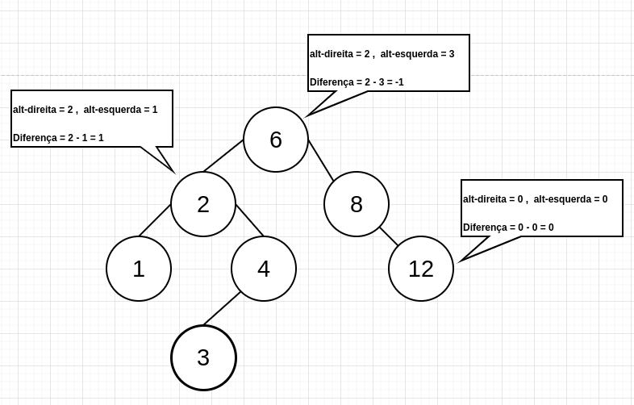
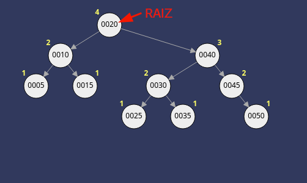

# Árvores AVL

## Definição
Criada
Árvore AVL se trata de uma estrutura de dados que obedece a todas as propriedades da árvore binária e que em cada nó a diferença entre a altura da subárvora da direita e da esquerda é de **1**, **0** ou **-1**. Esta diferença é chamada **Fator de Balanceamento**. 

O balanceamento facilita efetivamente a busca de um elemento, por exemplo, se temos uma árvore balanceada com 10.000 elementos, precisaríamos fazer apenas 14 comparações para encontrar um elemento.

## Calculando melhor nó raiz de um árvore AVL

Ao se analisar uma árvore, dentre os seus nós, qual nó seria uma raiz adequada para torná-la perfeitamente balanceada?

 - O nó cuja chave representa a **mediana das chaves** presentes nos nós que compõem a árvore, para uma árvore com número impar de nós. 
 - Ou o nó cuja chave representa um dentre **os dois valores mais próximos da mediana** das chaves presentes nos nós que compõem a árvore, para uma árvore com número par de nós.

## Rotação
Quando a diferença de altura de um nó for maior que 1 ou menor que -1, então, a árvore está desbalanceada e necessita de uma rotação, simples ou dupla, conforme tabela: 

| Nó Desbalanceado | Filho do Nó Desbalanceado | Tipo de Rotação                                       |
|------------------|---------------------------|-------------------------------------------------------|
| +2               | +1                        | Simples à esquerda                                    |
| +2               | 0                         | Simples à esquerda                                    |
| +2               | -1                        | Dupla com filho  para a direita e pai para a esquerda |
| -2               | +1                        | Dupla com filho  para a esquerda e pai para a direita |
| -2               | 0                         | Simples à direita                                     |
| -2               | -1                        | Simples à direita                                     |

## Exemplo de Balanceamento 

Tomemos, por exemplo, a seguinte árvore:

Se quisermos adicionar o valor 055, ele iria parar á direita no nó 050, gerando um desbalanceamento na subárvore cuja raiz é o 045. Portanto, para balancear a árvore é necessário uma rotação simples à esquerda, conforme animação:

## Referências
- [Algoritmos e Estruturas de Dados/Árvores AVL](https://pt.wikibooks.org/wiki/Algoritmos_e_Estruturas_de_Dados/%C3%81rvores_AVL)
- [UNIVESP - Estruturas de Dados - Árvores AVL](https://www.youtube.com/watch?v=1JKucLqAPZ8&t=1214s)