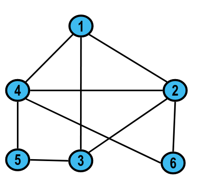
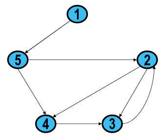
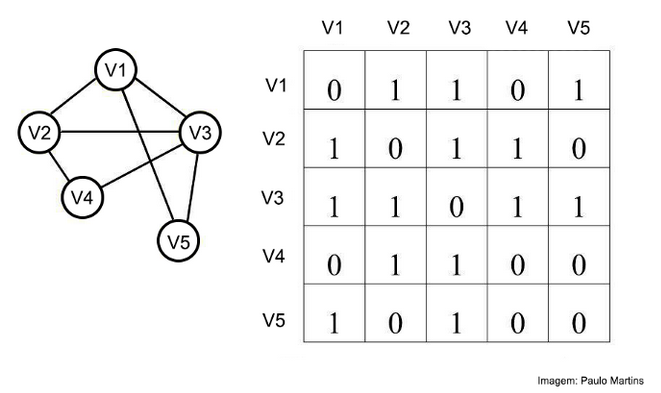
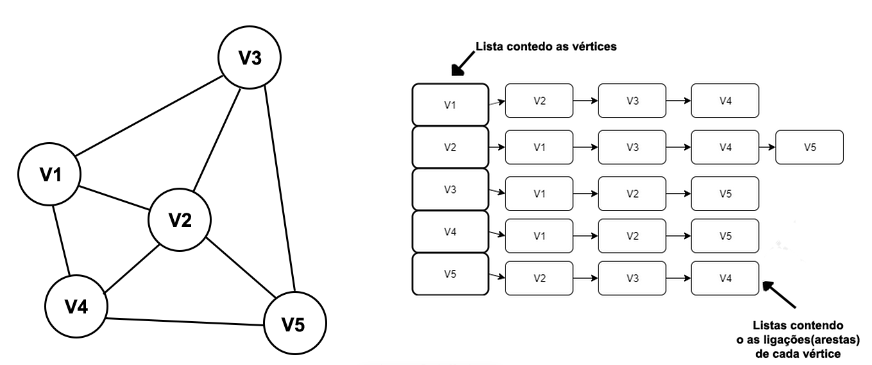

# Grafos

## Definição 

Se com filas e pilhas vimos estrutura de dados lineares, e com árvores vimos estruturas hierárquicas, com **grafos** veremos estruturas descentralizadas. 

A teoria dos grafos iniciou-se na cidade de Konigsberg, atual território da Rússia no ano de 1736, pelo matemático suíço Leonhard Euler (1707-1783)

Grafos são amplamente usados em matemática, mas sobretudo em programação. Formalmente, um grafo é uma coleção de vértices (V) e uma coleção de arcos (E) constituídos por pares de vértices. É uma estrutura usada para representar um modelo em que existem relações entre os objetos de uma certa coleção.

A teoria dos grafos estuda objetos combinatórios, pois os mesmos são bons modelos para muitos problemas em vários ramos da matemática, da informática, da engenharia, da química, da psicologia e da indústria.

### Grafos Não direcionados

Um grafo é dito não direcionado se as relações representadas pelas arestas não têm sentido, ou
seja, arestas podem ser seguidas em qualquer direção, elas são bi-direcionais.

Em grafos não direcionados, o grau de um vértice é o número de arestas que incidem nele.

Observer que self-loops não são permitidos.

### Grafos Direcionados

Um grafo é dito direcionado se as arestas são pares ordenados de vértices, saindo de um em direção ao outro, ou seja, as arestas possuem uma direção.

Em grafos direcionados, o grau é o número de arestas que saem do vértice (grau de saída) mais o número de arestas que chegam (grau de entrada).

## Formas de Representação

### Matriz de Adjacências
A matriz de adjacências de um grafo é uma matriz booleana com colunas e linhas indexadas pelos vértices. Uma matriz de adjacência qualquer (M) terá a quantidade de vértices (n) de número de linha e colunas, ou seja, uma para cada vértice

### Lista de Adjacências
Consiste numa lista qual cada elemento é um nó do grafo, logo a lista possui tamanho equivalente ao número de vértices do grafo. Ela possui n lista ligadas, estas contem as conexões de cada arestas do vértice.

## Aplicações
- Modelagem de Circuitos Eletrônicos:
    * Placas de circuito impresso.
    * Circuitos integrados
  
- Redes de Transporte
    * Representação de Rodovias:
    * Mapa de Vôos
    * Mapa de Metrô 

- Redes de Computadores:

    * Redes Locais
    * Internet
  
- Bancos de Dados:
    * Diagrama Entidade-Relacionamento

- Ciências:
    * Átomos conectados por ligações químicas
    * Espécies conectadas filogeneticamente
    * Animais conectados por relações ecológicas
- Redes Sociais

## Referências
 - [Curso Livre de Estruturas de Dados/Grafos](https://pt.wikiversity.org/wiki/Curso_Livre_de_Estruturas_de_Dados/Grafos)
 - [O que é um grafo estrutura de dados?](https://todasasrespostas.pt/o-que-e-um-grafo-estrutura-de-dados)
 - [ICMC - USP - Grafos I: Conceitos & Aplicações](http://wiki.icmc.usp.br/images/5/59/Grafos_I.pdf)
 - [Grafos — representação e implementação](https://medium.com/@paulomartins_10299/grafos-representa%C3%A7%C3%A3o-e-implementa%C3%A7%C3%A3o-f260dd98823d)