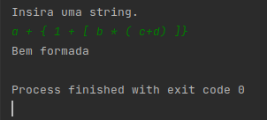

# Listas Encadeadas / _Linked Lists_

## Definição
Uma lista ligada é uma lista linear que a ordem lógica dos elementos **não** é a mesma da ordem física.

Os elementos estão em sequência, ou seja, tem exatamente um **sucessor** e um **predecessor**, porém, 
estes elementos estão espalhados na memória.

Cada elemento precisa indicar em que endereço o seu sucessor pode ser encontrado de modo a manter a ordem lógica.

Isso é feito através de um ponteiro.

### Vantagens:
- Maior controle na inserção e remoção de elementos.
- Número de elementos pode aumentar ou diminuir durante a execução do programa.
- A manutenção da ordem lógica não exigirá deslocamentos de elementos.

### Desvantagens:
- Retira o acesso em **tempo constante** a qualquer elemento, dado o índice do elemento.
- Precisa percorrer todos os elementos predecessores, um por um.
- A busca binária deixa de fazer sentido.


## Implementação de Pilha

O código abaixo foi implementado na [videoaula 08](https://www.youtube.com/watch?v=Xlkh6-10ILw) usando o conceito de pilha com listas encadeadas, e a finalidade deste código é verificar a se todos os parênteses, colchetes e chaves abertos em um determinado texto, foram corretamente fechados. 

## Código

=== "node_type.h"

    ```cpp
        typedef char ItemType;
        /*
         Estrutura usada para guardar 
         a informação e o endereço do 
         próximo elemento.
        */
        struct NodeType
        {
          ItemType info;
          NodeType* next;
        };
    ```

=== "stack.h"

    ```cpp

        #include "node_type.h"
        class Stack {
        public:
        Stack();  // Construtor       
        ~Stack(); // Destrutor
        bool isEmpty() const;
        bool isFull() const;
        void print() const;
        
        void push(ItemType);
        ItemType pop();  
        
        
        private:
        NodeType* structure;
        };        

    ```

=== "stack_alinhamento.cpp"

    ```cpp
        
        #include "stack.h"
        #include <iostream>
        
        using namespace std;
        
        int main() {
        ItemType character;
        Stack stack;  
        ItemType stackItem;
        
        cout << "Insira uma string." << endl;
        cin.get(character);
        
        bool isMatched = true;  
        while (isMatched && character != '\n')
        {
          if (character == '{' || character== '(' || character==  '['){  
         stack.push(character);
          }
          if(character == '}' || character== ')' || character==  ']'){    
         if (stack.isEmpty()) {
           isMatched = false;
         } else {
           stackItem = stack.pop();
           isMatched = (
                     (character == '}' && stackItem== '{')
                     || (character== ')' && stackItem == '(')
                     || (character== ']' && stackItem == '[')
                     );
         }
          }
          cin.get(character);
        }
        
        
        if (isMatched && stack.isEmpty() ) {
        cout << "Bem formada \n";
        } else {
        cout << "Mal formada \n";
        }
        }    
    ```

=== "stack_encadeamento.cpp"
    
    ```cpp
        #include "stack.h"
        #include <cstddef> // Para funcionar o NULL
        #include <new>
        
        #include <iostream>
        using namespace std;
        
        Stack::Stack(){
          structure = NULL;
        }
        
        Stack::~Stack(){
          NodeType* tempPtr;
          while (structure != NULL) {
            tempPtr = structure;
            structure  = structure -> next;
            delete tempPtr;
          }
        }
        
        bool Stack::isEmpty() const {
          return (structure == NULL);
        }
        
        /*
          Aqui eu simplesmente verifico se o usuário possui memória
          disponível para alocar um novo elemento.
        */
        bool Stack::isFull() const {
          NodeType* location;
          try {
            location = new NodeType;
            delete location;
            return false;
          } catch(std::bad_alloc exception){
            return true;
          }  
        }
        
        /*
          Adicionar um novo item no topo da pilha. O nó que acabamos de criar
          deve apontar para quem estava no topo da pilha e o ponteiro
          structure deverá apontar para o novo nó.
         */
        void Stack::push(ItemType item){
          if (!isFull()){
            NodeType* location;
            location = new NodeType;
            location->info = item;
            location->next = structure;
            structure = location;
          } else {
            throw "Stack is already full!";
          }
        }
        
        /*
          Devolve o objeto que está no topo da pilha. 
         */
        ItemType Stack::pop(){
          if (!isEmpty()) {
            NodeType* tempPtr;
            tempPtr = structure;
            ItemType item = structure->info;
            structure        = structure->next;
            delete tempPtr;
            return item;
          } else {
            throw "Stack is empty!";
          }
        }
        
        void Stack::print() const
        {
          NodeType* tempPtr = structure;
          while (tempPtr != NULL) {
            cout << tempPtr->info;
            tempPtr  = tempPtr->next;
          }  
          cout << endl;
        }
    ```


## Alguns detalhes da implementação

- ```typedef``` é usado para definir previamente o tipo de uma variável;
- ```private``` / ```public``` são níveis de configuração/permissão dentro de uma classe;
- ```struct``` parecido com classe, porém, toda a interface é pública;
- ```->``` este sinal serve para acessar os campos de um ponteiro;  
- O ponteiro structure sempre apontará para o elemento que está no topo da pilha.
- Os arquivos com final ".h" contém classes ou structs que deverão ser incluídas nos demais códigos; 
- O arquivo "stack_encadeamento.cpp" define o comportamento das funções,
- O arquivo "stack_encadeamento.cpp" contém a **main()**, que chama de modo ordenado todas as demais funções.

## Exemplo de Saída


---
# Referências 
- [Prof. Douglas Maioli - Aula 05 Estrutura de Dados - Lista Encadeada]([url](https://www.youtube.com/watch?v=84wIYtNUKEg))
- [Prof. Douglas Maioli - Aula 06 - Estrutura de Dados - Lista Encadeada]([url](https://www.youtube.com/watch?v=zu0Xw5gPft0&t=892s))

