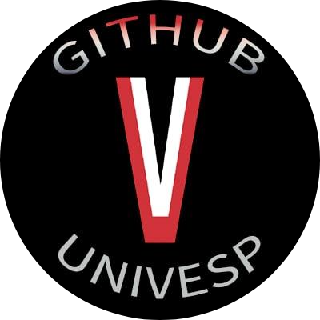

# Eixo Computação - UNIVESP - Grupo de estudos

## Disciplinas:

### :zap: Algoritmo e Programação de Computadores I e II (COM110 e COM120)

__Objetivo:__ Compreender conceitos básicos de programação e descrever algoritmos para resolver problemas utilizando a
linguagem de programação Python, incluindo depuração e testes automatizados básicos. Reforçar a prática de programação
em Python, composição de programas com múltiplos arquivos de código fonte, uso de bibliotecas, APIs (WEB) e GUIs. Noções
de programação orientada a objetos.

### :zap: Banco de Dados (COM300)

__Objetivo:__ Introdução a banco de dados (Processamento de Arquivos vs SGBDs, arquitetura de SGBDs), modelagem de
dados (conceitual, modelo entidade- relacionamento), Linguagem de Consulta e Manipulação de Dados (SQL), Indexação,
Bancos de Dados Não Relacionais ou NoSQL (Bancos de Dados Orientados a Documentos, Bancos de Dados em Colunas, Bancos de
Orientados a Grafos). Mapeamento objeto-relacional (ORM).

### :zap: Estruturas de Dados (EID001)

__Objetivo:__ Estruturas básicas para representação de informações: pilhas, filas e listas ligadas, árvores, grafos,
tabelas de hash e suas generalizações, implementações. Algoritmos para construção, consulta e manipulação de tais
estruturas. Desenvolvimento, implementação e testes de programas usando tais estruturas em aplicações específicas.
Page-Rank.

### :zap: Fundamentos da Internet e Web (COM130)

__Objetivo:__ HTML5,CSS3: Estrutura do conteúdo versus aparência do documento, tags HTML básicas (H1, P, etc) e e
extensíveis (div, span, etc), atributos básicos de CSS (color, text-align, etc); seletores CSS;

### :zap: Programação Orientada a Objetos (EEP101)

__Objetivo:__ Arquitetura de Software: Coesão e acoplamento; Aprofundar os conceitos básicos de orientação a objetos,
entre eles: classes, objetos, interfaces, herança e polimorfismo; Introduzir técnicas de tratamento de erros com
exceções; noções de padrões de projeto (explorando alguns exemplos como Observer, Adapter, Null Object); Apresentar
noções de aspectos, funções anônimas, closures e técnicas funcionais (Map,Filter, Fold, etc).

### :zap: Redes

  

